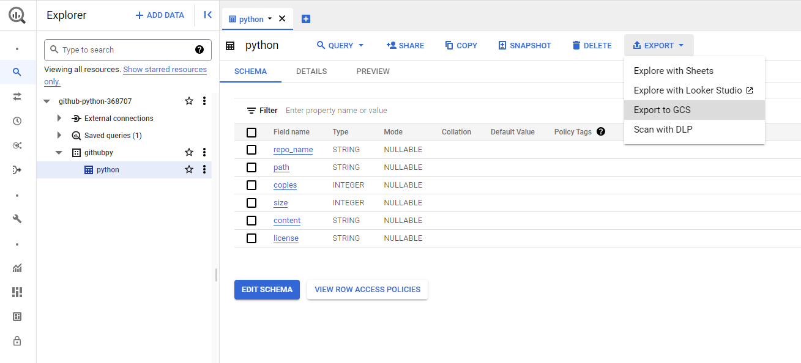

# Mining GitHub using Google BigQuery: step-by-step guide 

## Introduction

In this guide, we will go through all the steps to mine GitHub using Google BigQuery. In less than 15 minutes, you will be able to retrieve any files from GitHub and download their content and metadata on your local storage. 

This guide focuses on retrieving all `.py` files from all repositories hosted on GitHub using a basic SQL query. The same principle and steps from this guide apply to retrieve whatever type of file you want by editing the query.

---

## Project and dataset setup

The first step is to create a project on Google Cloud. You will be asked to provide a name for the project. For this guide, I will name the project `Github Python`.

<p align="center">

</p>

Once the project has been created, you should receive the following notification:
<p align="center">

</p>

Next, navigate to your BigQuery SQL workspace:
<p align="center">

</p>

From there, you can create a dataset inside your current project. Here, I named the dataset `githubpy`.
<p align="center">

</p>

Now you can create tables to store the results of the SQL query we are going to be running using BigQuery. Create one table as follows:
<p align="center">

</p>

## Preparing and executing the query

The query we are going to execute is the following:
```sql
SELECT
  f.repo_name,
  f.path,
  c.copies,
  c.size,
  c.content,
  l.license
FROM
 (select f.*, row_number() over (partition by id order by path desc) as seqnum
      from `bigquery-public-data.github_repos.files` AS f) f
JOIN
  `bigquery-public-data.github_repos.contents` AS c
ON
  f.id = c.id AND seqnum=1
JOIN
  `bigquery-public-data.github_repos.licenses` AS l
ON
  f.repo_name = l.repo_name
WHERE
  NOT c.binary
  AND ((f.path LIKE '%.py')
    AND (c.size BETWEEN 0
      AND 1048575))
```
It basically retrieves all .py files from the repositories in GitHub. It also get some metadata about the the files and project such as the name of the repository, the path of the file inside the repository or its size. 

In your workspace, compose a new query:
<p align="center">

</p>

Next, we need to change the settings of the query in order to map it the table we created previously. Navigate to `More -> Query Settings` and change the dataset and table of destination:
<p align="center">

</p>

Optionnally, you can save the query to re-run it later on, or to keep track of it. 

You can now click the `Run` button to execute the query. After only a few minutes, the query should be completed and the results should appear on your workspace:
<p align="center">

</p>

## Transfering the table data into a bucket

One very efficient way to export the data is to use buckets on the Google cloud storage. In our case, we are going to export all the data from the table to the bucket as jsonl files compressed using GZIP.

First, go to to your buckets (`Cloud storage -> buckets`). Then, create a new bucket. Inside that bucket, you can also create folders which can be useful if you export multiple tables inside the same bucket.

Then, go back to your BigQuery SQL workspace and export the table by clicking on `Export -> Export to GCS`:
<p align="center">

</p>

On the new window, select your bucket and chose the following name for the file `data-*.jsonl"gz`. We need to use a wildcards to enable the system exporting the data into multiple files as one file would be too big. Here's the summary of the exportation:
<p align="center">

</p>

Once you click save, the exportation should be initiated and you should see it in your personal history:
<p align="center">

</p>

After a few seconds/minutes, the job should be completed and you are now able to see all your jsonl.gz files inside your bucket:
<p align="center">

</p>

## Downloading the data on your local storage

The final step simply consist of downloading your bucket on your local storage. I recommend using the `gsutil` API available in Python:
```bash
pip install gsutil
gsutil config
gsutil -m cp -r gs://your-bucket your-output-directory
```